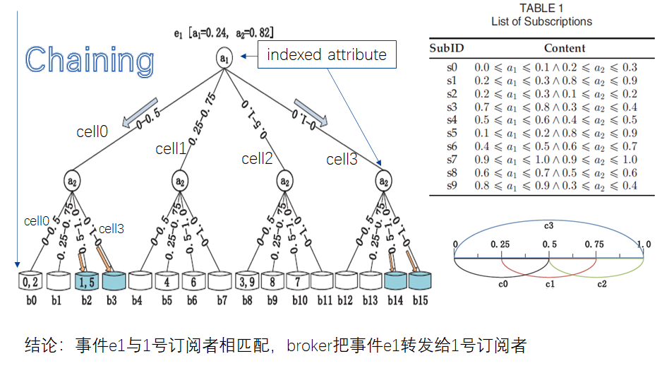
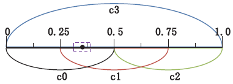
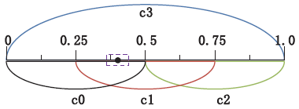
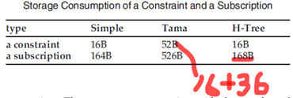
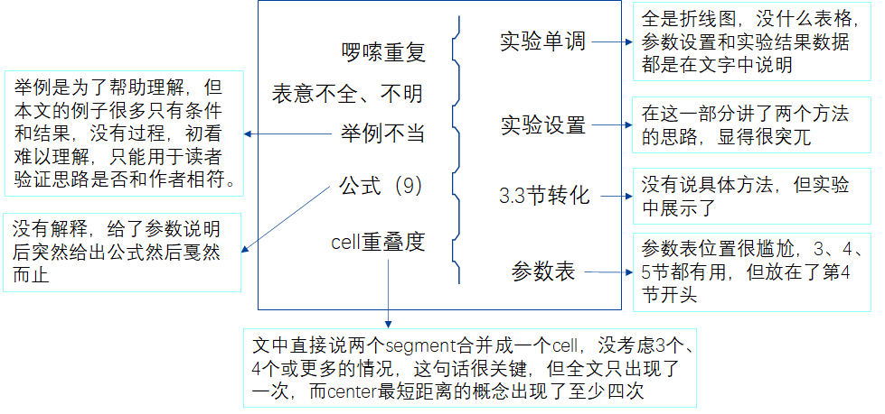

## H-Tree: An Efficient Index Structure for Event Matching in Content-Based Publish/Subscribe Systems

### 1. Introduction

#### Basic idea: 

把相似的订阅放入同一个桶里，桶作为树底层的叶子节点，事件通过逐层过滤得到较少的桶，然后在较少的桶里找出匹配的订阅。

### 2. **Pub/Sub Systems**

* Publishers: 生产事件者

* Middleware：转发事件者，由broker组成，在broker上执行事件匹配算法

* Subscribers：订阅事件者

  

  1. 内部的broker处理更多的事件（瓶颈）

  2. 一个event由m个属性值组成, 通过归一化使每个属性取值区间为[0,1.0]，比如：e1={(current,10.4),(voltage,223),(power,2300)}
  3. 一个订阅sub有一个subID, 最多由k个属性值上对应的取值区间组成，k<=m，比如Sub[0]={(current,5,15),(voltage,150,300)}，Sub[0]与e1相匹配；Sub[1]={(current,5,11),(power,1500,1900)}，Sub[1]与e1不匹配

### 3. Design of H-Tree

#### 3.1 **Overview**

* 现有的 matching algorithms:
  1. identifying satisfied constraints
  2. picking out matched subscriptions
* 缺点：waste much time on processing partially matched subscriptions
* H-Tree的本质: a combination of hash lists and hash chaining

#### 

* The construction of H-Tree： 

  1. Select indexed attributes to from the events’ attributes.
  2. The value domain of each indexed attribute is divided into cells on which a **hash list** is built.
  3. The hash lists realized on all indexed attributes are **chained** into a hash tree.

  

#### 3.2 **Selection of Indexed Attributes**

* Give four heuristic rules:
  * 优先选择受欢迎的属性：对在属性上有取值要求的订阅者数量进行排序，选择排名前 l 的 l 个属性进行indexed
  * 优先考虑（窄的取值区间的订阅者数量多）的属性：取值区间越窄越好，这样可以划分出更多的cell，cw<=1
  * Indexed attributes的先后顺序不影响性能，相似的订阅还是在同一个桶里
  * Indexed attributes的个数受限于memory size，据实验，每增加一个indexed attribute 匹配时间减少35%

#### 3.3 **Division of Value Domains**

1. **Cell划分规则**:

   确保订阅者的每个属性上约束的取值区间的长度小于一个上限 **w** , 将0-1分成  1/w 个段，**相邻两个段组成一个cell**，cell的长度是2w，一共有1/w个cell，要使cell数量增多，w必须减小，但w是取值区间上限，不能减少了，故cell个数必须小于1/w；

2. **CellID计算规则**:
   1. 订阅者没有指定某个属性上的约束，则将subID放入c3对应的桶
   2. 属性约束的center值在[0,0.25]or[0.75,1.0]，则对应的cellID是c0 or c2
   3. 否则，center值处于两个cell区间中，离哪个cell的center近就放入哪个cell

放入c0放入c1

3. **重叠策略比不重叠策略好：**

   1. 桶(bucket)大小

      不重叠策略中，一个约束区间可能跨两个cell，导致最终要在 $2^l$个桶里存subID, $l$ 是indexed attribute个数；重叠策略中一个subID只会分配到一个桶里。

      
      
   2. 桶(bucket)个数
   
      桶的个数随 l 指数式增长，对每个indexed attribute，不重叠策略比重叠策略需要的桶数多1。一个例子：w=0.2, l=8, 不重叠策略要$5^8$个桶，重叠策略要$4^8$，前者是后者的6倍。
   
      

4. **非均匀分布可以转化为均匀分布:**

   * 令$Y=F(X)$，则$X=F^{-1} (Y)$
     $$
     \begin{eqnarray}P(0≤Y≤y≤1)&=&(0≤F(X)≤y)  \\
                               &=&P(x≤F^{-1} (y)) \\
               &=&F(F^{-1}(y))\\
               &=&y
     \end{eqnarray}
     $$

   * 所以Y是均匀分布，根据Y值构造H-Tree, 让subID在各个桶里分布均匀

   * 以上是我所补充的，具体论文没有写。（这是审稿人提的问题, 为了让各个桶均匀分布）

   * 3.3节最后一句话：The transformation is very simple without any costly computation.   Therefore, the cost of transformation is negligible.

#### 3.4 **Chaining of Hash Lists**

* Based on overlapping division, the hash lists of all indexed attributes are chained into a hash tree. 
* In nature, H-Tree is a hash table created by putting similar subscriptions(measured by the centers of the range constraints) in a bucket.
* Only the subIDs of subscriptions(4B/个) are stored in the buckets, not the content of the subscription, so storage consumption is very small.
* **优点**：
  * 在某个属性上，一个事件e最多匹配 3 个cell。设c是一个索引属性上的cell个数，则H-Tree的每层过滤掉  ${c-3\over c}$ 的subIDs，需要check的订阅者数随索引属性的增多而指数下降
  * 最终每个桶里的subIDs匹配成功的概率(**matching probability**)大大增加, H-Tree返回匹配subID的时间更早了，事件转发更快，减少了内部broker的压力，减少了端到端延时。

#### 3.5 **Tradeoff between Time and Space**

### 4. Theoretical Performance Analysis

### 5. Experimantal Performance Evaluation

1. 简介Simple和Tama两种算法

2. 用单一变量法，从以下因素测量匹配时间：订阅者个数，数值分布，订阅者的约束个数(RCA=${k\over m}$)，索引属性个数(树的高度)，cell划分个数，最大区间宽度w，属性分布规律(Zipf分布)

3. 对插入时间、删除时间做实验，对内存消耗做了理论分析

   

### 6. **My comments**

大家可以带着这些问题去读论文看是不是存在这些问题