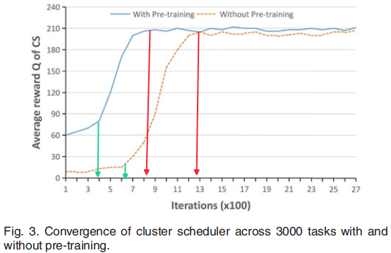
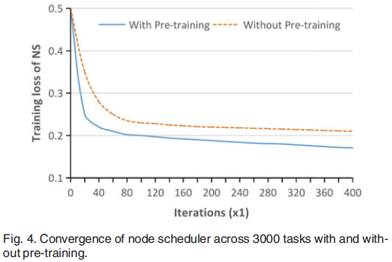
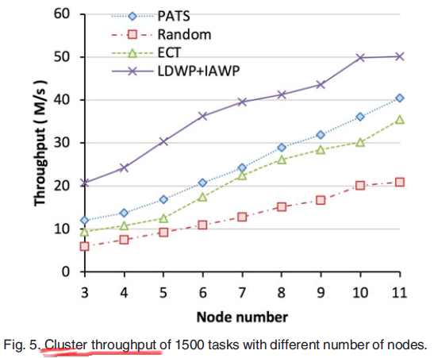
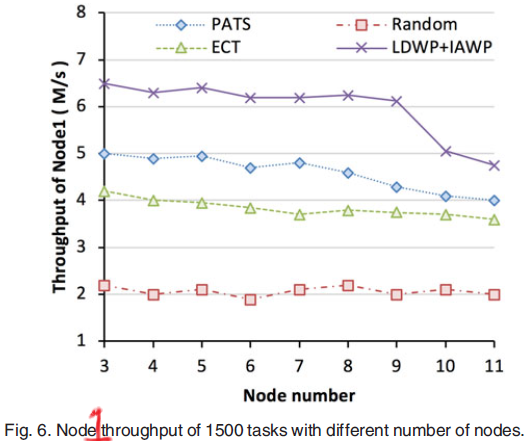
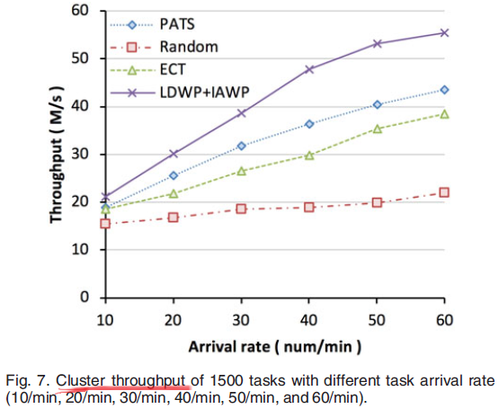
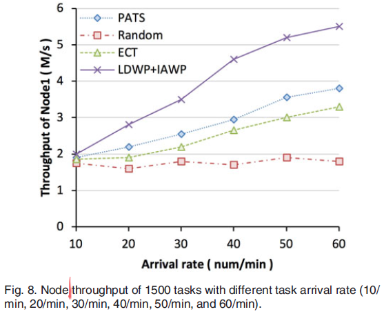
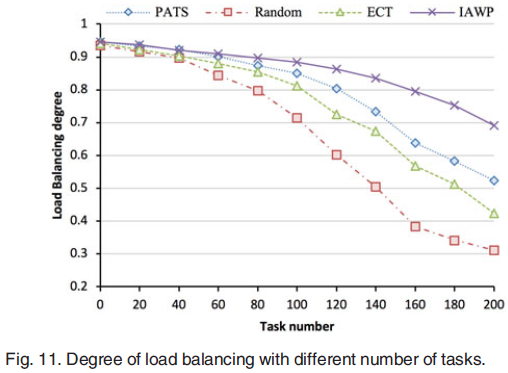

## Learning-Driven Interference-Aware Workload Parallelization for Streaming Applications in Heterogeneous Cluster

### 1. Motivation

* 以前要么只考虑了**hybrid** CPU-GPU下的任务调度问题，没考虑**异构**heterogeneous clusters下的任务调度问题
* 要么只考虑了<u>data center level</u> and <u>cluster level</u>的任务调度，没考虑GPU资源的充分利用
* 要么只考虑了**异构**clusters中的任务之间**干扰**问题，没考虑**hybrid** CPU-GPU架构
* 要么只考虑了**learning-driven**任务并行策略，没考虑资源竞争带来的**干扰**问题
* （我加）SP综述P6: Heterogeneous processing nodes might influence the processing speed of the SP application in all types of infrastructure（single-node, cluster, cloud, fog, CPU&GPU）.

### 2. Problem&&Objective

##### Problem

streaming application **parallelization** problem with fine-grained task **division** and task **interference** **detection** in the CPU-GPU **heterogeneous** cluster.

##### Objective

1. maximize the cluster task **throughput** in long term through automatically generating the best scheduling <u>actions</u>
2. improve the resource **utilization** by considering the task <u>interference</u>

##### Quality of Service(QoS)（我加）

* 资源利用率高
* 任务吞吐量大
* 弹性可扩展性强（elasticity）

### 3. Technique

* pre-training

* Stag1-Learning-Driven Workload Parallelization (**LDWP**)      --  cluster scheduler

  * 基于Deep Reinforcement Learning (**DRL**)

  * 作用：为相互独立的任务选择一个合适的最优的执行节点
  * <u>cluster-level</u> scheduling model  
    * use deep Q-network(**DQN**)
    * 根据运行状态、cluster环境、任务特征，执行最优并行调度动作

* Stag2-Interference-Aware Workload Parallelization (**IAWP**)   --  node scheduler 

  * 基于Neural Collaborative Filtering (**NCF**)

  * 作用：确定子任务依赖的合适异构计算单元个数，考虑子任务干扰

* 迁移学习 transfer learning technology

  * 作用：重建(rebuild)任务调度模型，提高泛化能力，
  * parameter-transfer method for <u>cluster level</u>: 当异构cluster发生改变时基于之前构造的模型快速生成一个高效调度网络
  * for node-level: 将现有的NCF模型参数应用在新加入的工作节点上

### 4. Prerequisites

##### Deep Reinforcement Learning(DRL)

* learning goal: maximize the expected cumulative reward
* future discounted reward $R_t=\sum_{t'=t}^{T}\gamma^{t'-t}r_{t'}$
* optimal action-value function $Q^*(s,a)$: maximum expected return that can be achieved by following a policy after observing some state sequence s and then taking some action a.
* Bellman equation $Q^*(s,a)=\pmb E[ r+\gamma max_{a'}Q^*(s',a')]$
* $Q(s,a;\theta) \approx Q^*(s,a)$
* model-free Q-learning algorithm: 
  * iteratively update $Q(s,a;\theta)$
  * choosing actions that maximize a quality function $Q_{t+1}(s_t,a_t)$ at a specific time step t
  * 用非线性approximators时高度不稳定，不收敛

* Deep Q-Network (DQN): much more stable
  * Q-network: A neural network function approximator with weights $\theta$
  * like Q-learning, be trained iteratively by <u>updating the parameters $\theta$</u> of the Q-network to reduce the <u>mean-squared error of Bellman equation</u>
  * optimal target value $y=r+\gamma max_{a'}Q(s',a';\theta^-)$, $\theta^-$ is from some previous iteration
  * loss functions $L_i(\theta_i)=\pmb E [(r+\gamma max_{a'}Q(s',a';\theta_i^-)-Q(s,a;\theta_i))^2]$
  * parameters $\theta$ are updated by Stochastic Gradient Descent (**SGD**) algorithm
  * At each time-step t, action is selected by an $\varepsilon$-greedy policy with respect to the current Qnetwork

##### Neural Collaborative Filtering(NCF)

* 广泛用于推荐系统

* neighborhood based method

  * similarity between users or the similarity between items

* latent factor model:

  *  characterizes both users and items in a latent factor domain

  * Matrix Factorization (**MF**): mapping the rating matrix into a joint latent space of user and item features

  * K: the dimension of the latent feature space; M: Users; N: items; rating matrix $R_{M\times N}$; $y_{ui}$ represents the rating that user u gives to item i.

  * $R_{M\times N}=U_{M\times K}V_{K\times N}$, $U_u$ user latent feature vector, $V_i$ item latent feature vector

  * $\hat{y}_{ui}=f(U_u,V_i)=\sum_{k=1}^KU_{uk}V_{ik}=U_u^TV_i$

  * 缺点：

    * cold start problem / sparsity problem

    * fixed inner product不能捕获非线性的复杂特征

* Multi-Layer Perception (MLP) network

  * Inputs: user latent vector $\pmb u_u$ and item latent vector $\pmb v_i$ obtained from the embedding layer
  * Outputs: predicted score $\hat{y}_{ui}$
  * $\hat{y}_{ui}=\phi_{out}(\phi_X(...\phi_2(\phi_1(\pmb{u}_u,\pmb{v}_i))...))$, X是隐藏层个数，$\phi$ 是映射函数

### 5. Problem Analysis

* Workload Model
  * 任务之间没有依赖，子任务之间才有，子任务共享任务的所有输入数据
  * $T_i=(TID_i,TSize_i)$, $TID_i$ 是任务类型的编号，$TSize_i$ 是输入数据的大小
  * $T_i=G(N_i,E_i)$, G is workflow graph
  * $N_i=\{ST_{i1},...,ST_{i,n_i}\}$ , $n_i$ 是第i个任务的子任务个数，$ST_{ij}=(STID_{ij},TSize_i)$
  * $E_i^{jk}\in E_i$ 表示一条从子任务 $ST_{ij}$ 指向子任务$ST_{ik}$的边（依赖关系）
  * association pattern 子任务利用数据的特征与任务的输入数据之间的关系

* System Model

  * 分布式计算平台：a cluster manager node and a cluster of hybrid CPU-GPU worker nodes，each worker node comprises multicore CPUs and multiple GPUs；cluster manager node 上有Cluster Scheduler(CS), 每个worker node上有一个Node Scheduler(NS)

  * cluster manager node:

    * respond to the task processing requests of the Application System (AS)
    * control the task execution in the cluster
    * analyze each task to get the task-related configuration requirements, adds the task to a task waiting queue of the cluster
    * Cluster Scheduler (CS) collects the information of worker node resource and task execution states, use LDWP to schedule the tasks in the waiting queue to the appropriate worker nodes

  * a task processing request can be divided into a series of independent tasks(minimum scheduling unit)

  * 任务分配给一个节点后，先被划分成子任务，放入subtask pending queue or subtask ready queue，然后Node Scheduler(NS) 用IAWP 为等待队列里的子任务选择合适的计算单元(CPU or GPU) 

  * 分配给GPU的子任务先被放入priority queue，然后NS根据子任务间的干扰IAWP执行合适的子任务

  * M worker nodes $\{S_1,...,S_M\}$

  * Node State Vector $S_i(t)=(Sr_i^c(t),Sr_i^g(t),Sr_i^{cm}(t),Sr_i^{gm}(t),Sr_i^{tx}(t),Sr_i^{rx}(t))$, r可能是利用率的意思

    | Variable       | Meaning                    |
    | -------------- | -------------------------- |
    | $Sr_i^c(t)$    | CPU utilization            |
    | $Sr_i^g(t)$    | GPU utilization            |
    | $Sr_i^{cm}(t)$ | Host memory utilization    |
    | $Sr_i^{gm}(t)$ | GPU memory utilization     |
    | $Sr_i^{tx}(t)$ | Node uplink traffic rate   |
    | $Sr_i^{rx}(t)$ | node downlink traffic rate |

* Interference Analysis

  * 一个GPU可以同时执行多个任务

  * 有相似特征的子任务可能竞争相同的资源，当在同一个GPU上run时就会发生干扰，通过IAWP预测优先级队列的子任务与正在运行的子任务的相似度，避免同时运行

  * 竞争资源

    * Streaming Multiprocessors(SM), memory resources (L1 cache, L2 cache, texture cache and DRAM memory), interconnect network

    * 前两类用利用率量化
    * 第三个用global load throughput和global store throughput metrics量化
    * 用这些指标衡量相似性

### 6. WORKLOAD PARALLELIZATION IN HETEROGENEOUS CLUSTER

##### Design Overview（和第5节差不多）

* Stage 1：CS用LDWP把task queue的top task分配给M个worker nodes中的一个

  * 用DQN model for cluster level scheduling

  * DQN 输入：the current environment observation vector，包括计算平台资源特征和任务特征
  * DQN输出：所有调度动作的期望价值，执行值最大的那个动作

* Stage  2：NS把ready queue的top subtask分配给N个计算单元中的一个，如果是分配给了一个GPU，则放进priority queue，再用IAWP选择合适的subtask执行

  * 用NCF model估计子任务的speedup、性能指标值
  * speedup：在GPU上运行比在CPU上运行所获得的相对性能增益
  * NCF 输入：subtask vector and metric vector
  * NCF 输出：一个子任务的性能指标预测值
  * IAWP首先根据speedup的大小顺序分配给计算单元让部分运行起来，然后计算运行的子任务和ready的子任务间的相似度，进行并行子任务分配

##### Task Scheduling in Heterogeneous Cluster

* DQN Based LDWP Scheduling Method

  * Action Space：即选哪个工作节点跑任务，$A_{CS}=\{S_1,...,S_M\}$
  * State Space: 

    * 观察向量$x_t$是所有任务特征向量$T_i$和所有节点状态向量$S_j(t)$的集合，即$x_t=(TID,TSize,Sr_1^c(t),Sr_1^g(t),Sr_1^{cm}(t),Sr_1^{gm}(t),Sr_1^{tx}(t),Sr_1^{rx}(t),...,Sr_M^c(t),Sr_M^g(t),Sr_M^{cm}(t),Sr_M^{gm}(t),Sr_M^{tx}(t),Sr_M^{rx}(t))$
    * 状态$s_t$是 t 之前的所有观察向量和动作，$s_t=x_1,a_1,x_2,a_2,...,x_{t-1},a_{t-1},x_t$, 这就是DQN的输入
  * Reward: 在当前状态$s_t$进行$a_t$动作，得到新状态$s_{t+1}$和回报 $r_t$, $r_t=t+1$时的吞吐量$ - t$时的吞吐量
  * experience tuple $e_t=(s_t,a_t,r_t,s_{t+1})$ 记录尝试玩一下的信息
  * replay memory $D_t=\{e_1,...,e_t\}$ 用于记录重玩信息
  * 用mini-batch随机采样$e_t$, 减小模型更新的方差，提高学习过程稳定性
  * 为进一步提高稳定性，在Q-learning update中分离出一个target network用于生成target Q value y，target network和evaluation network的结构是一样的，每做$\mu$步迭代target network才拷贝evaluation network的参数，在Q值更新到Q值更新影响target value之间增加了一个delay，减少了发散和振荡
  
* 算法一：LDWP O(PM)
  * E=10，T=6, $\mu$=2，Q函数=伤害计算方法														  O(1)
  * 玩游戏，最多只能实验 10 次，得到一个伤害最高的玩法  
  * 每次游戏可以发 6 次技能，即把T个任务分配到node上
  * 选择发哪个技能让伤害最大

    * 按30%的概率随便选择一个技能，即把一个任务随便分给一个node      O(1)

    * 按70%的概率选择伤害最高的技能，通过Q函数估算每种技能的伤害    O(PM)
  * 发出这个技能$a_t$，得到敌情 $x_{t+1}$ 和伤害值$r_t$                                                   O(1)
  * 记录这次技能的效果                                                                                           O(1)
  * 随机选一个历史技能                                                                                           O(1)

    * 如果这是最后一次玩，就懒得纠正Q函数和更新了                                  O(1)

    * 根据经验判断这个情况这个走位到底对不对                                             O(PM)
    * 如果不对，纠正它                                                                                        O(1)                                  

    * 根据纠正后伤害增加值优化Q函数的伤害值估算方法            
  * 每发2次技能，通过复习Q更新我们的经验                                                       O(PM)
  
* Discussion：

  * 预训练：先随机初始化参数，用MLP网络训练直到收敛，将得到的参数作为DQN模型的初始参数

  * 可扩展性：用迁移学习，根据之前DQN模型隐藏层的参数学习新环境下的DQN模型

##### Task Scheduling in CPU-GPU Node

* 建模

  * $ST_{ij}=(STr_{ij}^{C},STr_{ij}^{Mem},STr_{ij}^{SM},STr_{ij}^{L1},STr_{ij}^{L2},STr_{ij}^{Tex},STr_{ij}^{Dram},STr_{ij}^{Tpl},STr_{ij}^{Tps},TSize_i)$，代表每一个子任务需要的性能开销

    | Variable          | Meaning                                |
    | ----------------- | -------------------------------------- |
    | $STr_{ij}^C$      | CPU usage                              |
    | $STr_{ij}^{Mem}$  | Host memory usage                      |
    | $STr_{ij}^{SM}$   | GPU Streaming Multiprocessor(SM) usage |
    | $STr_{ij}^{L1}$   | GPU L1 cache usage                     |
    | $STr_{ij}^{L2}$   | GPU L2 cache usage                     |
    | $STr_{ij}^{Tex}$  | GPU texture cache usage                |
    | $STr_{ij}^{Dram}$ | GPU memory usage                       |
    | $STr_{ij}^{Tpl}$  | Global load throughput of GPU          |
    | $STr_{ij}^{Tps}$  | Global store throughput of GPU         |

  * SubTask Description Matrix (STDM): 每行代表一个子任务的性能指标向量，外加一列代表子任务的speedup估计值，即 $ST'_{ij}=(ST_{ij},spd)$

  * 每来一个子任务，随机测两个$ST'_{ij}$中的指标，用linux proc file system 测CPU指标，用NVIDIA profiler tool测GPU指标

  * 为了评估测试时间profiling time取多少为好，先完全执行了16个子任务获得每个子任务的所有性能指标值，然后分别执行2s、3s、4s、5s、6s测量每一项性能指标，算出每种情况下的准确率，最终得到4s时的准确率为92.3%，之后增加缓慢，所以profiling time取4s

  * 设置一个CPU和一个GPU作为profiler去专门评估每个到来的子任务的两个指标，生成的向量stitch到STDM里；如果没子任务到来，他们也可以去执行子任务

* 基于NCF预测指标

  * input layer（这里没说清楚到底是什么, 我猜了点）：types of a subtask（$\pmb x_s$我猜是任务的ID, M行一列，M个子任务），a performance metric（$\pmb v_m$我猜是指标的编号, N行一列，N个指标），用one-hot编码转成二进制稀疏向量
  * embedding layer：把稀疏向量映射为稠密向量，称为“embedding vector”，看成是隐藏因子模型中的隐藏向量
  * $\pmb U^T\pmb x_s=$ subtask latent vector $\pmb u_s$
  * $\pmb V_T\pmb x_m=$ metric latent vector $\pmb v_m$
  * $\pmb U \in \mathbb R^{M\times K}$ latent factor matrix for subtasks，M是子任务个数
  * $\pmb V \in \mathbb R^{N\times K}$ latent factor matrix for metrics，N是指标个数
  * MPL迭代式：

  $$ {MPL}
  \begin{eqnarray}
  \pmb a_1 &=& \phi_1(\pmb u_s,\pmb v_m)=
  \left[ \begin{matrix}  \pmb u_s  \\ \pmb v_m  \end{matrix} \right],\\
  \phi_2(\pmb a_1) &=& g_2(\pmb W_2^T\pmb a_1+\pmb b_2),\\
  &...... \notag \\ 
  \phi_L(\pmb a_{L-1}) &=& g_L(\pmb W_L^T\pmb a_{L-1}+\pmb b_L), \\
  \hat{y}_{sm} &=&\sigma(\pmb h^T\phi_L(\pmb a_{L-1}))
  \end{eqnarray}
  $$

  * $\pmb W_x$权重矩阵，$b_x$ 偏置向量，$g_x$ 激活函数用的Relu(适合稀疏向量，避免过拟合)，$\pmb h$ edge weights of the output layer

  * Loss function(又用了SGD):
    $$
    J=\frac 1 {2MN}\left[ \begin{matrix}\sum_{s=1}^M\sum_{m=1}^N(\hat y_{sm}-y_{sm})^2+\lambda \sum_{w_{sm}}w_{sm}^2 \end{matrix} \right]
    $$
    

* NCF Based IAWP Scheduling Method

  * 有一个CPU核空闲，就把最小speedup估值的子任务分配给它
  * GPU子任务优先级队列是定长的，队列没满时就把speedup估值最大的入队
  * 在GPU内进行干扰检测，只考虑GPU相关的指标，即$G_i=(STr_{ij}^{SM},STr_{ij}^{L1},STr_{ij}^{L2},STr_{ij}^{Tex},STr_{ij}^{Dram},STr_{ij}^{Tpl},STr_{ij}^{Tps},TSize_i)$, 用cosine计算相似度：$cos(\theta)=\frac{\pmb G_i\pmb G_j}{||\pmb G_i||||\pmb G_j||}=\frac{\sum_{k=1}^nG_{ik}\times G_{jk}}{\sqrt{\sum_{k=1}^nG_{ik}^2}\sqrt{\sum_{k=1}^n}G_{jk}^2}$, $cos(\theta)$越大表示$\theta$越小，相似度越大
  * 对每个优先级队列中的子任务，计算其与每个正在执行的子任务的相似度，取平均值的倒数作为优先级
  * 如果GPU和设备内存的利用率低于给定的阈值，NS就把最高优先级的子任务分配给GPU去执行

* 算法：IAWP   O(n+nG)(=O(n))

  1. 初始化STDM和随机权重$\pmb W$                                    O(n)

  2. 定义两个特征向量$\pmb x_s,\pmb x_m$作为NCF的输入

  3. 从embedding layer获得隐藏向量$\pmb u_s,\pmb v_m$             O(n)

  4. 用MLP预测STDM中的缺失值$\hat y_{sm}=\phi_{out}(\phi_X(...\phi_2(\phi_1(\pmb u_s,\pmb v_m))...)) $                                 O(n)?

  5. 基于损失函数对网络权重$\pmb W$执行一次梯度下降运算, 填满STDM矩阵                                        O(n)?

  6. 如果CPU空闲，分配一个最小speedup的子任务给它（只要一个子任务CPU就不会空闲了）O(n)

  7. GPU优先级队列如果没满，不断分配最大speedup的子任务给它直到队列满                           O(n)?

  8. 对每个优先级队列中的子任务:                                                               (node里一共G个GPU)  O(nG)

     8.1 从STDM里提取子任务的与GPU相关的性能指标向量$\pmb G_i$

     8.2 计算这个子任务与所有当前正在执行的子任务之间的相似度

     8.3 根据相似度算出这个子任务的优先级

  9. 如果GPU和内存的利用率低于阈值，分配最高优先级的子任务给它                                         O(1)

* Discussion:

  * 和DQN一样先用MLP预训练收敛得到一套参数作为NCF的初始值，不同的是用了Adaptive
    Moment Estimation (Adam) algorithm
    * compute adaptive learning rates for different parameters
    * 比normal SGD的收敛速度更快
  * 将预训练得到的参数作为NCF的初始值，然后转用SGD进行优化，因为Adam需要保存momentum information以正确更新参数，不合适于NCF中参数的更新
  * 和DQN一样用了参数迁移方法（任务都不同了仍可以直接用，因为体现的是资源之间的一种普遍规律，而资源类型和资源特征是没变的）
    * 如果新增节点中GPU的个数和原来的一样，NCF模型可以直接用在新增节点上
    * 如果GPU个数变多了，就拷贝多份性能指标参数给每个GPU…
    * 假设一个节点内GPU的个数是2的指数次方个（这样方便参数迁移）

### 7. Experiment

##### Experiment Setup

* 12个物理服务器节点：1个作为cluster manager and cluster scheduler, 11个work node, 通过Gigabit switch相连

  | Type | CPU Num | Mem  | GPU Mem | GPU Num | Num  |
  | ---- | ------- | ---- | ------- | ------- | ---- |
  | 1    | 2       | 32GB | 24GB    | 2       | 2    |
  | 2    | 2       | 32GB | 8GB     | 4       | 4    |
  | 3    | 2       | 16GB | 24GB    | 4       | 4    |
  | 4    | 2       | 8GB  | 8GB     | 2       | 2    |

* CPU: Intel(R) Xeon(R) CPU E5-2620 v3@ 2.40 GHz with 16 cores

* GPU: Tesla P4 or Tesla K80

* Docker: 1.11.2-cs3

* Kubernetes: version 1.6.0 管理容器平台

* 视频处理任务：（有些子任务有CPU、GPU两个实现版本以方便调度）

  * intrusion detection

  * video synopsis

  * face recognition

    | Application         | Subtask Type Num | CPU version Pipeline operation                               | GPU version Pipeline operation                               |
    | ------------------- | ---------------- | ------------------------------------------------------------ | ------------------------------------------------------------ |
    | Intrusion Detection | 6                | GMM background modeling, Frame differencing, Gaussian pyramid, DOG pyramid, Scale space extrema detection, <u>Tracking</u> | GMM background modeling, Frame differencing, Gaussian pyramid, DOG pyramid, Scale space extrema detection |
    | Video Synopsis      | 5                | GMM background modeling, Frame differencing, Tube extraction, <u>Tube optimization, Stitching</u> | GMM background modeling, Frame differencing, Tube extraction, |
    | Face Recognition    | 7                | <u>Load image file, Face locations,</u> Face landmarks, Face encodings, Face distance, Compare faces | <u>Batch face locations</u>, Face landmarks, Face encodings, Face distance, Compare faces |

* DQN: multi-layer perception network with two hidden layers(分别有256和128个neurons)，每个neurons的激活函数都是Relu，用SGD优化，batch_size=20，learning rate $lr=0.1$, discount rate $\gamma=0.8$, 小的学习速率可以避免发散，大的折扣率可以兼顾到更长远的收益

* NCF: multilayer perception network with three hidden layers(分别有128、64、32个neurons)

##### Convergence

* convergence evaluation experiments：随机选3000个任务（1000个video synopsis任务，1000个intrusion detection任务，1000个face recognition任务），task arrival rate = 50个/min

* DQN预训练/无预训练实验

  

* NCF预训练/无预训练实验

  

##### Performance Analysis

* 3种比较方法：

  * random selection method
  * Expected Time to Compute (ETC) method：估算任务在每一个计算单元上运行的Minimum Completion Times(MCT), 分配给MCT最小的计算单元
  * PATS method：基于任务在CPU和GPU上运行所估计的relative performance和computational loads进行调度

* 1500个任务，每个任务从集合{500 video synopsis tasks, 500 intrusion detection tasks, 500 face recognition tasks}中随机选择，task arrival rate = 50个/min，分布式计算系统的吞吐量平均提高26.9%

* Impact of Cluster <u>Node Number</u>

  * 受到达速率的限制，节点为11时达到饱和，cluster throughput不再显著上升，但排队等待时间减少

    

  * 第一个节点上吞吐率随节点个数的变化，达到饱和后吞吐率会减小（负载均衡）：

* Performance With Different <u>Task Arrival Rate</u>

  * 一共还是1500个任务，以不同的任务速率(10-60个/min)提交，11个工作节点

    

    

* Evaluation of IAWP Method in Terms of <u>GPU Utilization</u>

  * 从系统基本稳定后开始统计，平均提高GPU利用率14.7%

* Evaluation of IAWP Method in Terms of <u>Load Balancing Degree</u>

  * 用资源利用率表示节点的负载均衡度，用负载均衡度的标准差表示cluster的负载均衡度，标准差越小越好
  * 节点$M_i$的负载均衡度 $Load_i=(U^{CPU}+U^{hMem}+U^{GPU}+U^{dMem})/4$, 即CPU利用率、主机内存利用率、GPU利用率、GPU内存利用率的平均值
  * 平均负载均衡度 $Load_{avg}=\sum_{i=1}^MLoad_i/M$
  * 负载均衡度标准差 $Load_{std}=\sqrt{\sum_{i=1}^M(Load_i-Load_{avg})^2/M}$
  * 集群cluster的负载均衡度 $Degree_{LoadBalancing}=1-Load_{std}$

  

* Evaluation of LDWP and IAWP Method in Terms of <u>Speedup</u>

  * Speedup: processing time of the Random method divided by the processing time of the other
    three methods.

  

* Performance With Cluster Changing

  * 随机选择任务提交，开始时8个节点，t1时增加3个节点，t2时减少两个节点，12分钟左右稳定

  

### 8. Related Work

##### Task Scheduling for Hybrid Architectures

* 没考虑系统运行时状态、任务干扰：

  * stochastic local search method 
  * Expected Time to Compute (ETC)

  * online reinforcement learning based task scheduler

  * predictive poweraware scheduling algorithm

  * exploring the relationship between task scheduling algorithms and energy constraints

* interference-driven cluster management framework: 检测过度干扰任务，在不同节点上重启任务

* Mystic：predict the interference，Collaborative Filtering (CF)，没考虑CPU-GPU异构

##### Task Scheduling in Heterogeneous Cluster

* heuristic energy-aware stochastic task scheduling strategy

* reliability maximization method with energy constraint

* Dynamic Voltage and Frequency Scaling(DVFS), 没考虑任务干扰

* 没考虑node level调度：

  * resource-aware hybrid scheduling algorithm: hierarchical clustering of the available resources into groups

  * stochastic dynamic level scheduling algorithm: 同时处理task dependency, time randomness, and processor heterogeneity

  * DRS：Dependency-aware and resource-efficient scheduling，用mutual reinforcement learning减少响应时间

* DRL-cloud：low energy cost, low reject rate, low runtime, fast convergence

* Learning driven parallelization for large-scale video workload in hybrid CPU-GPU cluster: 这篇论文的作者之前发表的，和这篇论文很像，但本文考虑了multi-tasking parallelism and interference avoidance on the GPU

### 9. Conclusion

* issue：efficient workload parallelization in CPU-GPU heterogeneous cluster and the interference of fine-grained tasks on the GPU
* propose：two-stage task scheduling approach for streaming applications based on <u>deep reinforcement learning</u> and <u>neural collaborative filtering</u>
* steps：
  1. cluster-level scheduler assigns task to the appropriate worker node according to
     the runtime system status and the characteristics of each task.
  2. node-level scheduler distributes subtask to the appropriate computing unit according to the estimated speedup.
  3. 被分配给GPU的子任务先进入一个优先级队列中，根据队列里的子任务与正在执行的子任务之间的相似度评估干扰程度，算出队列里子任务的优先级，然后进行调度
* 特点
  * 初始参数：pre-training
  * 可扩展性：transfer learning based generalization strategy, quickly rebuild an effective scheduling model when the computing power of the cluster changes

### 10. Assessment

* 图表不清晰
* 存在一些单词和语法错误
* NCF部分有待改进，各种推荐算法、SGD改进、Loss改进
* IAWP中计算的相似度可能是负数，取倒数后还是负数，不能直接作为优先级，实际上负数的优先级应该大于正数的优先级
* 泛化能力：
  * 没考虑同一个node内多个GPU之间的分配(GPU的优先级)
  * 没考虑GPU、CPU也有各种类型，而是用一个CPU一个GPU代表所有的CPU、GPU

