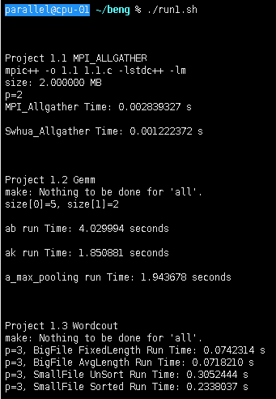

# Project1

#### 1.1 **MPI_ALLGATHER**

* 思路：用类似Binomial Tree的结构实现1传2,2传4,4传8，在6.10题实现的Bcast函数基础上稍作修改即可实现MPI_Allgather。

* ```shell
  cd 1.1
  make
  # 131072指每个进程传输131072个随机生成的double型数据(1MB)
  mpiexec -n 2 -f config ./1.1  131072
  cd ..
  ```


#### 1.2 Gemm

* 思路：ab=c, 把b矩阵按列优先存储(转置)，把矩阵分成子**网格**，每个进程负责计算结果矩阵c的一个子网格，0号进程把计算一个子网格需要的数据发给相应的进程，卷积和池化同理。

* ```shell
  cd 1.2
  make
  # 4个参数：a矩阵的行数，a矩阵的列数，b矩阵的列数，kernel size
  # 随机生成矩阵
  # 矩阵乘法，结果保存在 a1.txt b^T.txt ab.txt 三个文件里
  # 矩阵卷积，结果保存在 a2.txt k.txt ak.txt 三个文件里
  # 矩阵池化，结果保存在 a3.txt a_max_pooling.txt 两个文件里
  mpiexec -n 10 -f config ./1.2  1024 1024 1024 4
  cd ..
  ```


#### 1.3 **Wordcount**

* 思路

  * 用manager/work模式，0号进程负责读数据发给其他进程。
  * 对大文件有两种方法：每次发送固定长度的短文本；将文本一次性发给每个进程，使长度基本一样。
  * 对小文件也有两种方法：每来一个进程请求数据就发一个小文件过去；对所有小文件排序后按序发送。

* ```shell
  cd 1.3
  make
  # 需保证原始文件夹 big_file 和 small_file 和 1.3.c 放在同一目录 ./1.3/ 下
  # 大文件的计数结果在 big_file/final_result.txt 下
  # 小文件的计数结果在 small_file/final_result.txt 下
  mpiexec -n 3 ./1.3
  cd ..
  ```


###                                                 运行 run.sh 截图

