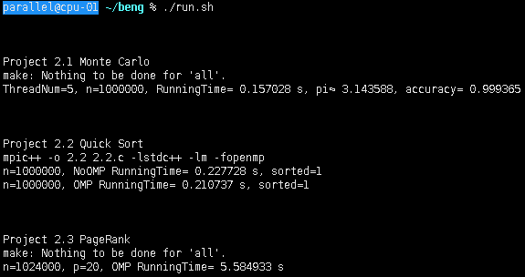

# Project2

### 2.1 **Monte Carlo**

* 思路：此题最重要的是保证并行线程生成随机数的随机性，保证生成的数不同，尝试了rand、rand_r、default_random_engine等四种方法，最后还尝试了靠单线程生成数组后再统计的方法。

* ```shell
  # 5个进程 1000000个点
  ./2.1 5 1000000
  ```


### 2.2 **Quick Sort**

* 思路：当数组长度小于50时用插入排序，减少线程数。

* ```shell
  # 1个参数：数组长度
  # 输出sorted=1表示结果是正确升序排列的，sorted=0表示结果是错误的
  ./2.2 1000000
  ```


### 2.3 **PageRank** 

* 思路：以0.85为DampingCoefficient，用guided的调度方式，用unordered_set存储链接号，避免有重复。

* ```shell
  # 页数 单页最大链接数 进程数
  ./2.3 1024000 10 20
  ```


###                                                 运行 run.sh 截图

