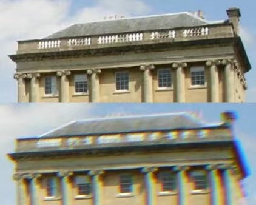

# A Multi-Hypothesis Approach to Color Constancy

* 什么是色差？

### 1. Abstract

* color constancy problem: learning camera specific illuminant mappings. （学习到是哪种光源在干扰拍摄）
* 现有模型：
  * 在具体的一些照骗上可以实现高准确率
  * 依赖于camera spectral sensitivity，光谱灵敏度（需要好的硬件支持）
  * 在新设备上泛化能力差
  * 回归方法得到的point estimates无法解释合理光源solution中潜在的模糊性（白细胞可能杀死好细胞），因为世界是复杂的、病态的（人之初，性本善，没有绝对善良的人，任何人都有杂念，任何光源都有杂质）
* propose Bayesian framework：通过多重假设策略解决color constancy ambiguity问题
  * 用data-driven的方式选择一批候选光源，照到一张<u>目标照片</u>上得到一批<u>修正照片</u>
  * 对每张修正照片，用camera agnostic(感觉不到的) CNN，估计这个光源是achromatic（可以消色差）的概率
  * 根据generated posterior probability distribution得到最终的光源估计（集众光源之所长）
* 优点：
  * likelihood estimator可以回答 camera-agnostic question（发现摄像机拍不出来的特征）
  * 将光源估计问题与监督学习任务分离，提高了multi-camera training效率，可以高效利用多个设备的数据集（某种程度上实现了设备无关性）
  * avoid distribution shift and mitigate well understood sensor domain gap problems
  * 如果相机候选光源已知，无需再训练model or fine-tuning(微调)
* 实验：
  * 为新型传感器通用化设置一套基准，避免重复训练
  * 在多个公共数据集上实现了最高的准确率，up to 11% <u>median angular error</u> improvement
  * 支持实时在线执行

### 2. Introduction

* Color constancy 问题：
  * 在拍摄时估计拍摄场景的光源颜色
  * 修正图像，让其外观和在消色差光源下拍的场景外观一致
* computational Color Constancy or Automatic White Balance(AWB): 恢复场景光源的算法过程（estimation of the global illumination color $\rho_k^E$ 主基调）
* 三色光传感器拍摄的physical model of Lambertian image formation
* 由于问题的病态性，多种光源解决方案在很广的概率下经常是可以有的，所以本文提出multiple hypothesis estimation来解决CC问题的模糊本质：用Bayesian formulation，**离散**化光源空间，估算每种光源能准确纠正被观察照片的概率，把合理的光源收集起来，于是这变成了一个分类问题
* 把AWB任务分成3个子问题（和摘要里说的一个意思）：
  * 选候选光源
  * 用shallow CNN估计光源是好光源的概率（什么是好的，可以消色差的就是好的）
  * 集众光源之所长，用estimated posterior probability distribution生成最清晰好看的图像
* Principled combination of datasets is of high value for learning based color constancy given the typically small nature of individual color constancy datasets (on the order of only hundreds of images).
* contributions：
  * 将Automatic White Balance(AWB)问题基于多假设分成三步流水线
  * 用多个摄像机学习，利用多个设备的数据集，提高精度
  * 对于新来的摄像机使用 training-free model adaptation strategy
  * 在NUS、Cube、Gehler-Shi三个数据集上做实验，前两个是state-of-the-art performance，后一个是competitive results

### 3. Related work

本文与之前相比的三个创新点：

* We estimate the likelihood probability distribution with a CNN which also <u>explicitly</u> learns to model the prior distribution for each illuminant
* Our method also discretises the illuminant space but we <u>explicitly</u> select the candidate illuminants, allowing for multicamera training
* our model learns to <u>infer</u> whether an image is well white balanced or not

### 4. Method

### Assumption

##### 打破的假设：

* highly dependent on strong **scene content** assumptions
* 高度依赖于设备
* images collected from the web are well white balanced

##### 未被打破的假设：

* the scene is illuminated by a <u>single or dominant</u> light source
* the average reflectance in a scene under a neutral light source is achromatic

* the color of the light and the surface reflectance are independent $P( l,R)=P(R)P(l)$

